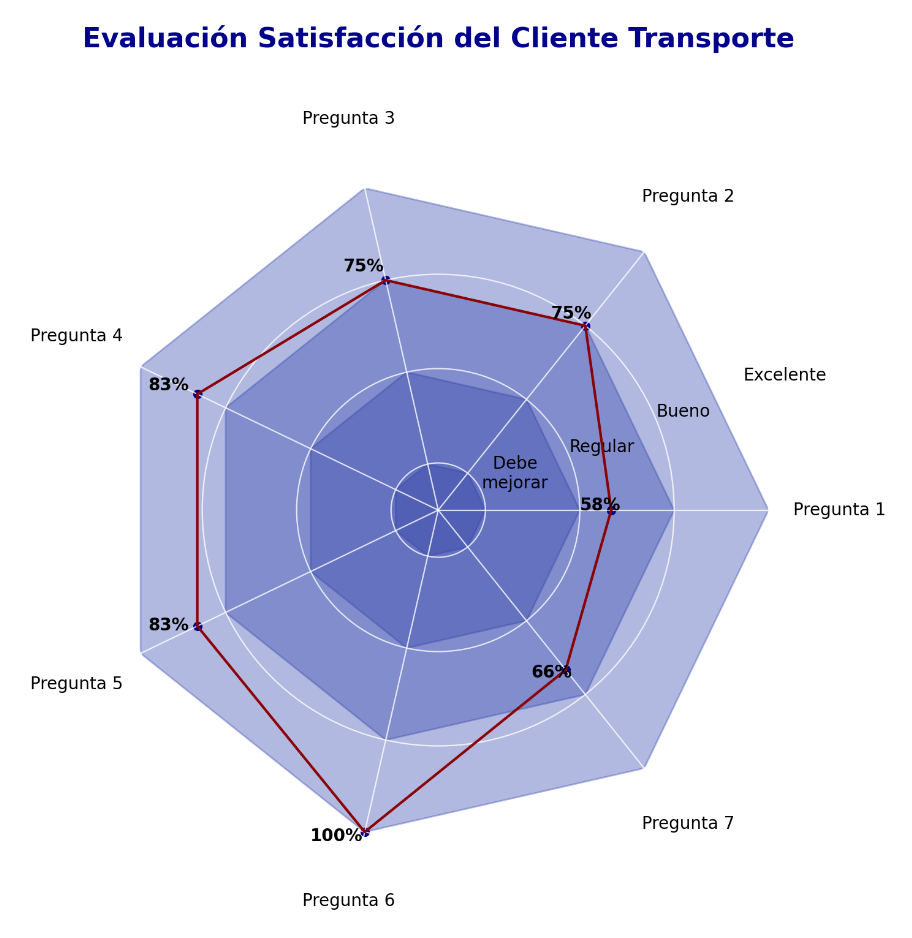

# Graficos-radar-Satisfaccion-del-cliente
Genera graficos resumidos  de los clientes de las empresas, el call center se comunica con los clientes 
y le realizan una serie de preguntas la cual caen en una BD luego se transforma esa data en base a las
preguntas realizadas y se genera un grafico basado en porcentaje del 1 al 100% tipo radar lo cual muestra
el porcentaje de cada pregunta por separado, se escalo a streamlit y tienen la facilidad de filtrar por mes
y region y tambien poder descargar el grafico como una imagen.

Ejemplo Visual

